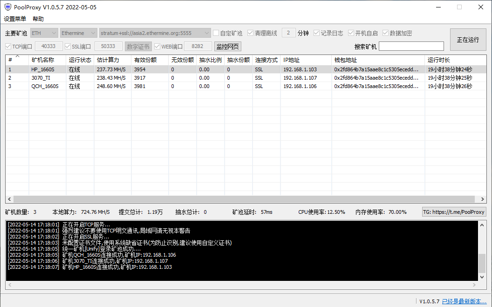
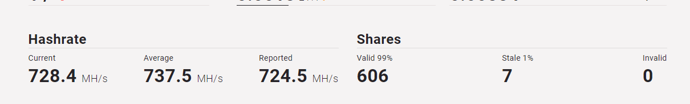
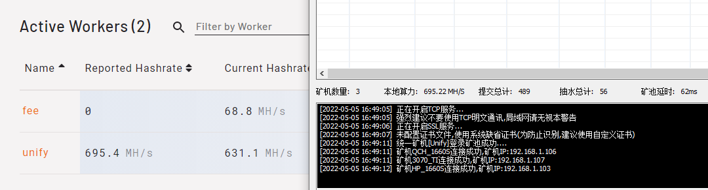

# PoolProxy
 稳定的矿池转发程序，纯中转模式无任何抽水；支持开机自动启动；支持ETH、ETC、ERGO、LTC、RVN等主流币种；支持矿池加密转发；支持SSL、自有证书；
 
[Telegram讨论组](https://t.me/PoolProxy)

### 注:
* 加密模式不需要VPS服务器,需要在本地局域网运行本软件
* 本软件仅为转发程序,需配合轻松矿工、开源旷工等挖矿软件使用
* 本软件为纯中转模式无任何抽水,没有软件开发费

### 软件界面

### 纯中转模式无任何抽水,实测本地算力724M,下图为矿池算力统计

### 实测带机400+内存占用不超100M

### 实测同时开启抽水和统一矿机两种模式,0算力损耗

